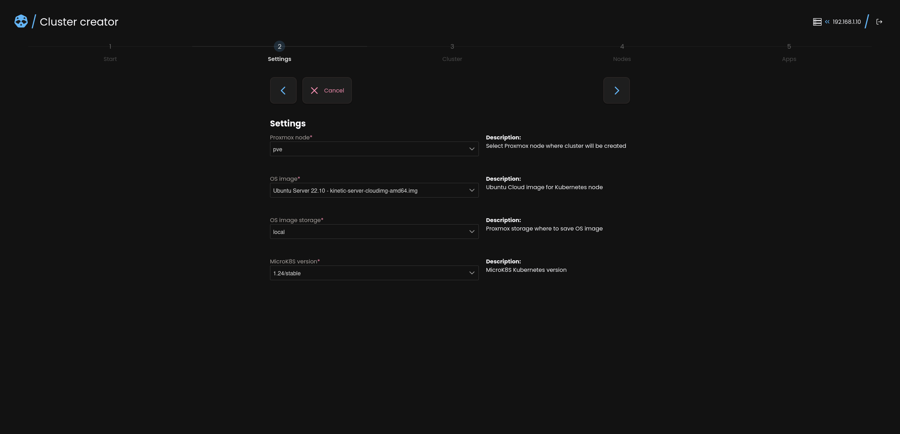
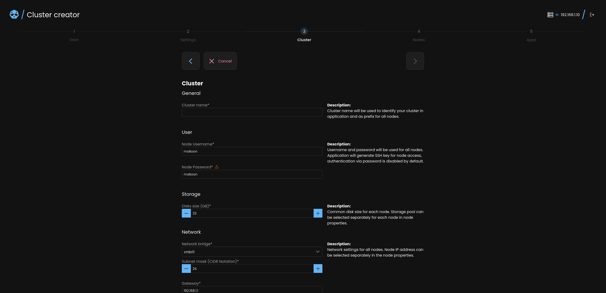
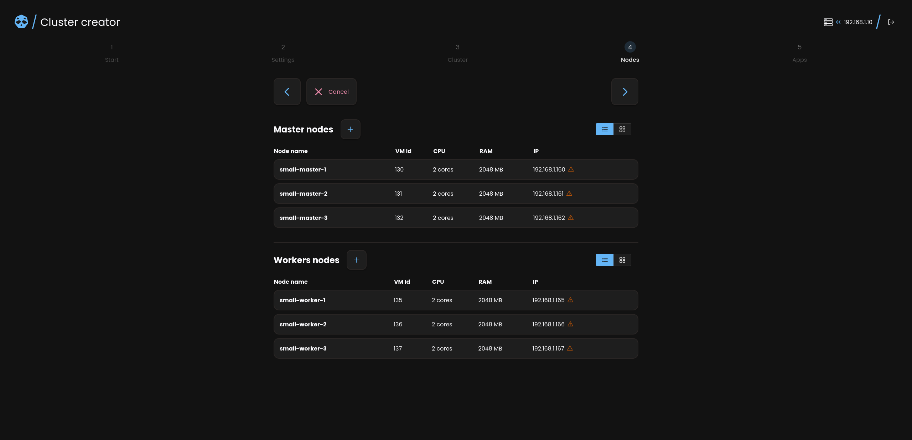
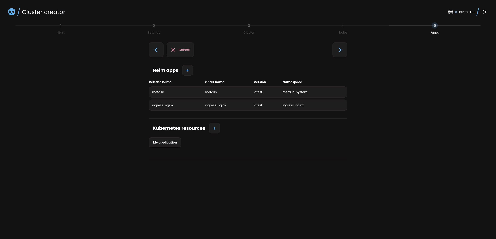
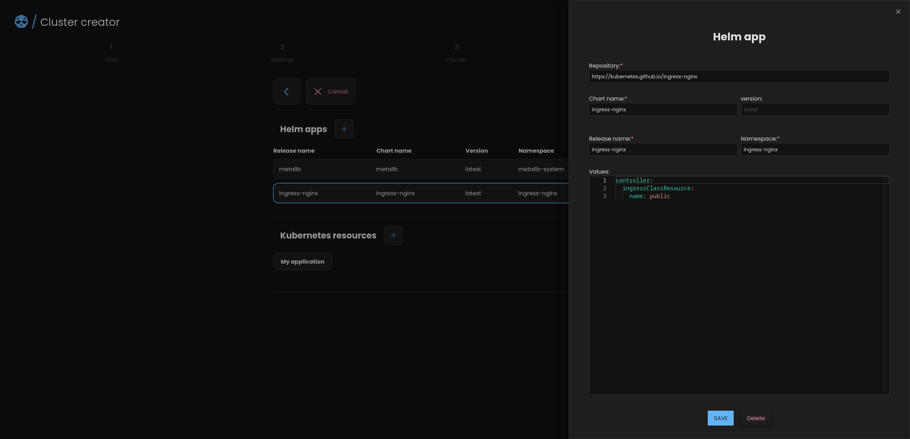
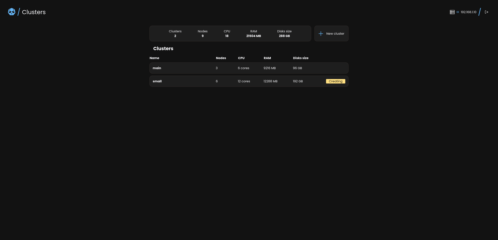
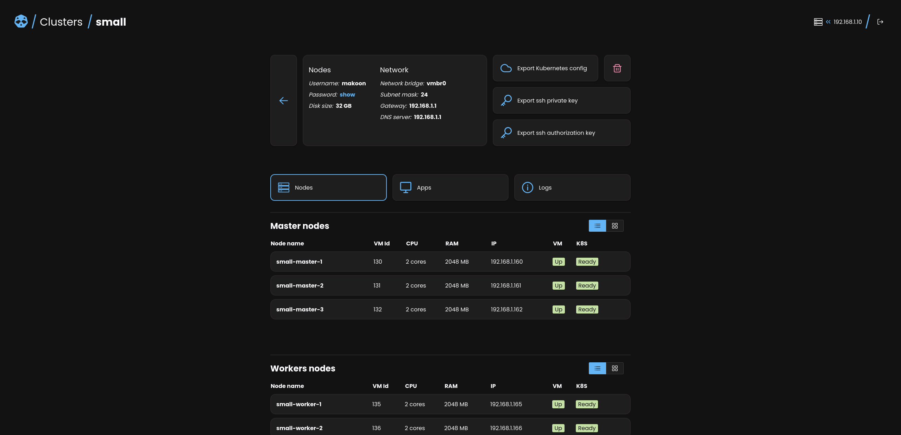
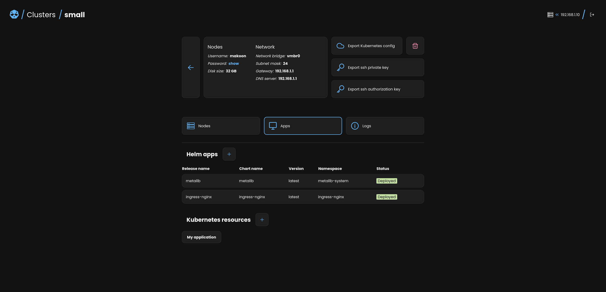
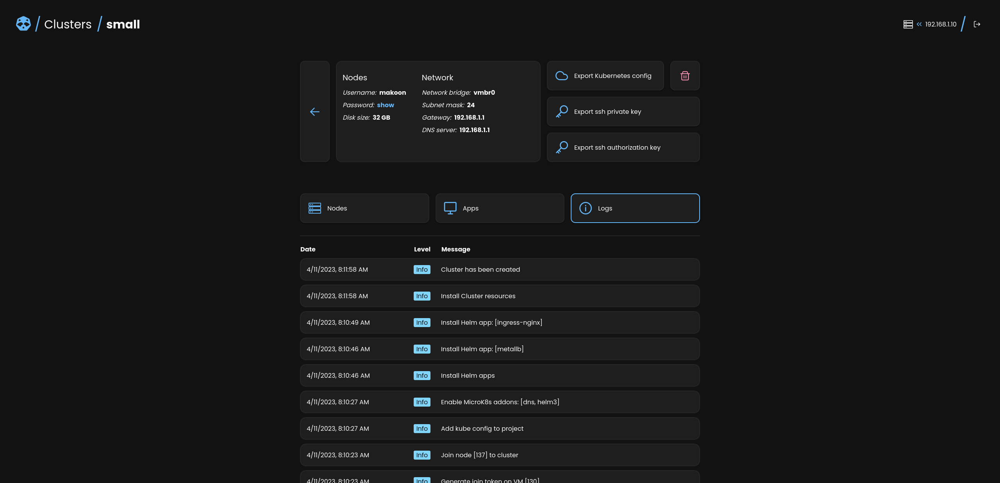

<p align="center">
  
</p>

## Table of contents

- [:grey_question: What is this?](#grey_question-what-is-this)
- [:pushpin: Installation](#pushpin-installation)
- [:hammer: Building from source](#hammer-building-from-source)
- [:blue_book: Licences](#blue_book-licences)
- [:camera: Screenshots](#camera-screenshots)

## :grey_question: What is this?

**Makoon** is a web application designed to make managing Kubernetes clusters in Proxmox VE as simple as possible.
With Makoon, users can manage MicroK8s multi-node clusters, Helm applications, and install/uninstall Kubernetes
resources without the need for complicated bash scripts, terraform or ansible.

### Key Features:

* Easy management of MicroK8s multi-node clusters
* User-friendly dashboard for managing Kubernetes resources
* Seamless integration with Helm applications
* Install/uninstall Kubernetes resources directly from the dashboard
* Support for multiple Proxmox VE nodes

### Additional information

* Proxmox 7.2-7 or later (previous versions were not tested)
* Supported MicroK8s versions:
    * 1.24/stable
* Support Ubuntu cloud images:
    * Ubuntu Server 22.10

## :pushpin: Installation

### Docker

```bash
# Create volume for Makoon data
docker volume create makoon_db
# Run container
docker run -d --name makoon -p8080:8080 --volume makoon_db:/app/data docker.io/sieradzki/makoon:latest
```

### Docker compose

```yaml
services:
  makoon:
    image: docker.io/sieradzki/makoon:latest
    ports:
      - 8080:8080
    volumes:
      - makoon_db:/app/data
volumes:
  makoon_db:
```

## :hammer: Building from source

To build a production package, run

```bash
docker build -t makoon:local .
```

## :blue_book: Licences

### Makoon can be used under two licences:

#### For personal use [PolyForm Noncommercial License 1.0.0](./LICENCE)

#### Internal Business Use [PolyForm Internal Use License 1.0.0](./LICENCE_INTERNAL_USE)

# :camera: Screenshots



















