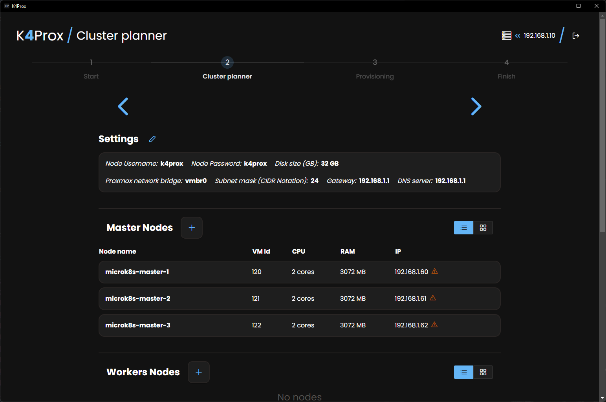
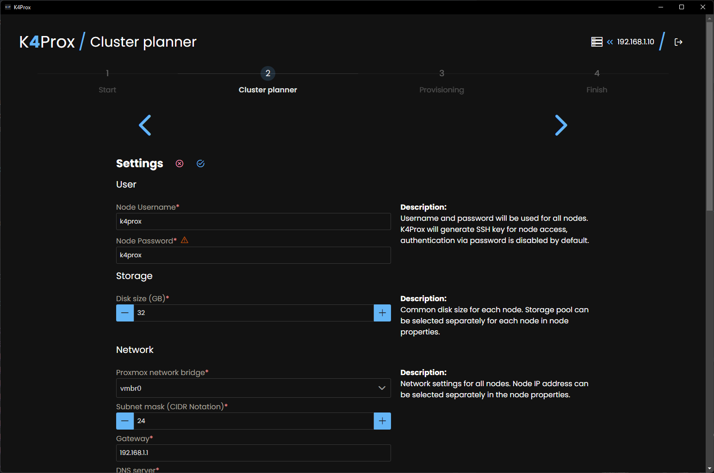
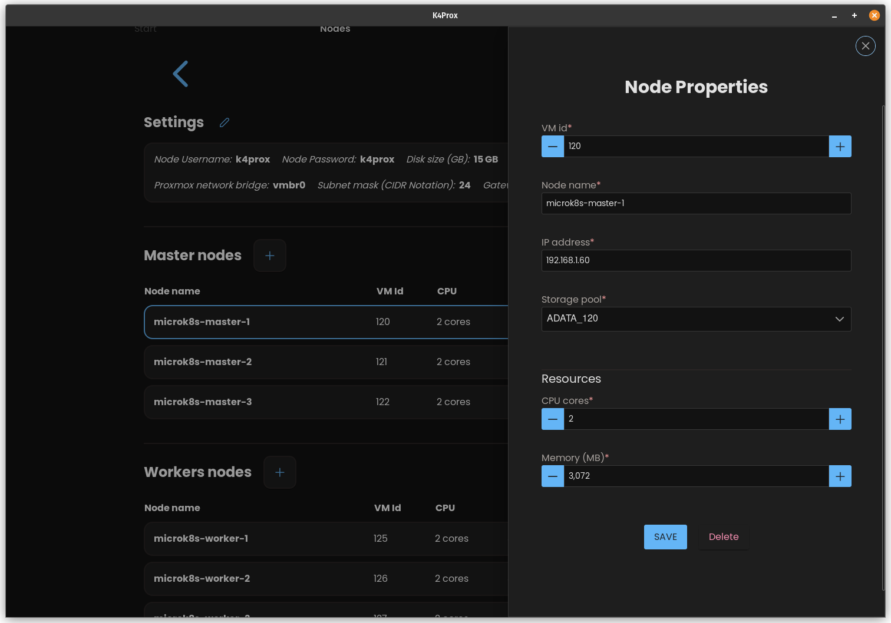
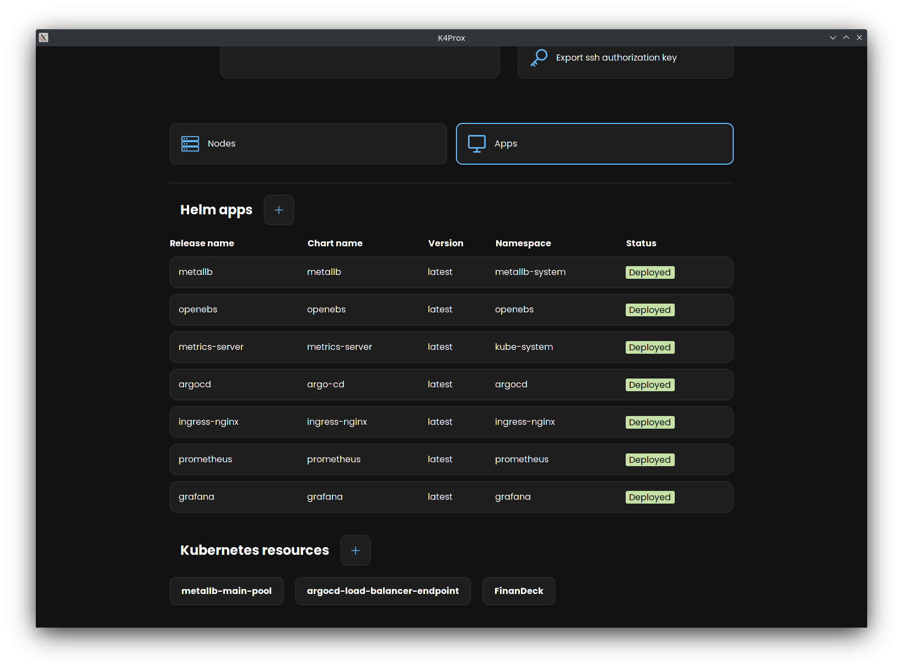

  

  

> **Announcement**
> 
> Hello, I decided that now is a good time for migrating K4Prox from the desktop to the web. Web application opens more possibilities for cluster management. Also, I have changed technology under the hood, the new version will be powered by Rust language.
> 
> Even though the first release will have the same features as the old app at the start,  the new version will bring better integration with Proxmox.    
> 
> No more interacting with your Proxmox server via SSH, all operations will be made using only Proxmox API. SSH will be used only for interacting with Kubernetes nodes due to the agentless nature of communication with your K8S nodes.   
> 
> K4Prox database file will be placed in Docker Volume instead on your Proxmox host filesystem, so the user has to take care about not losing volume(kubeconfig, private/public key). Of course, it is possible to get kubeconfig directly from VM, SSH can be generated on your own and replaced manually on VMs in case of disaster. By default, the database will not be backward compatible. 
> 
> The application also will change the name, K4Prox is hard to pronounce, which means this GitHub repository will be renamed too. Currently, I'm considering naming the application "Makoon"  
> 
> The application will be distributed via Docker image.   
> 
> I plan to drop the new version by the end of April 2023.   
## Table of contents

- [:grey_question: What is this?](#grey_question-what-is-this)
- [:pushpin: Planned features](#pushpin-planned-features)
- [:hammer: Building from source](#hammer-building-from-source)
- [:blue_book: Licences](#blue_book-licences)
- [:camera: Screenshots](#camera-screenshots)

## :grey_question: What is this?

**K4Prox** is an application for managing Kubernetes clusters in Proxmox VE *(tested on Proxmox 7.2-7)*.

**What does the K4Prox under the hood?**

- Generates the best possible default project for your environment
    * checks used vmid's in your proxmox to find the first free 20 id's
      range, starts from number round to 10 ex. 120, 400, 500 for the first node
    * determines automatically your network settings, like Gateway, Subnet mask and DNS server address
    * tries to figure out the IP range for VMs, uses ping
      application on your host - it's not guaranteed IP availability due to some devices on your network can have
      disabled ICMP protocol
- Create and configure VMs using Proxmox API and SSH
- Uses Ubuntu Cloud image + Cloud-Init as VM's OS
- Installs MicroK8s using snap
- Configure MicroK8s via SSH (installing addons, joining nodes to the cluster)

**Supported platforms:**

- Linux
- macOS
- Windows (Windows 10 and below requires Microsoft Edge WebView2, automatic installation is provided by Wails)

**Used technologies:**

- [Wails V2](https://wails.io/)
- Go 1.19
- React 18 (MobX, PrimeReact, Tailwind, Formik, Yup)

## :pushpin: Planned features
 - Add node to existing cluster
 - Delete node from existing cluster
 - Upgrade VM OS
 - Change VM resources
 - Create web application version

## :hammer: Building from source
### Install `Go` and `Node.js`
### Install Wails
Run `go install github.com/wailsapp/wails/v2/cmd/wails@latest` to install the Wails CLI.
### Live Development

To run in live development mode, run `wails dev` in the project directory.

### Building

To build a redistributable, production mode package, use `wails build`.

## :blue_book: Licences
### K4Prox can be used under two licences:
#### For personal use [PolyForm Noncommercial License 1.0.0](./LICENCE)
#### Internal Business Use [PolyForm Internal Use License 1.0.0](./LICENCE_INTERNAL_USE)

# :camera: Screenshots

