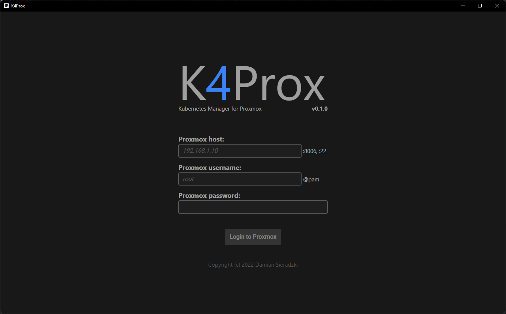
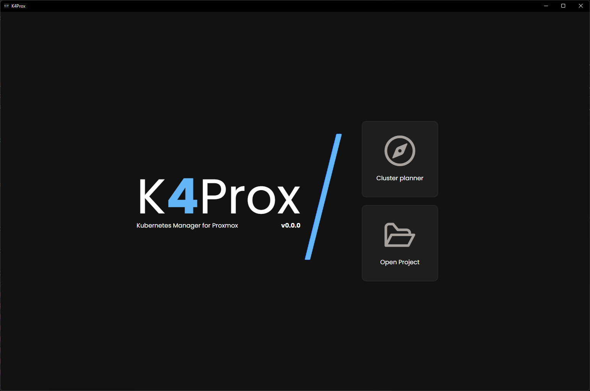
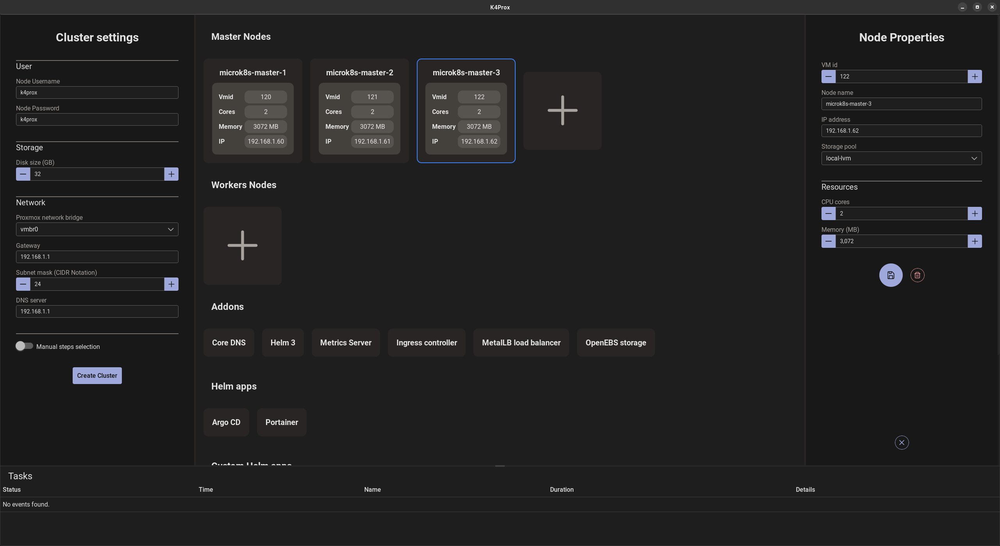
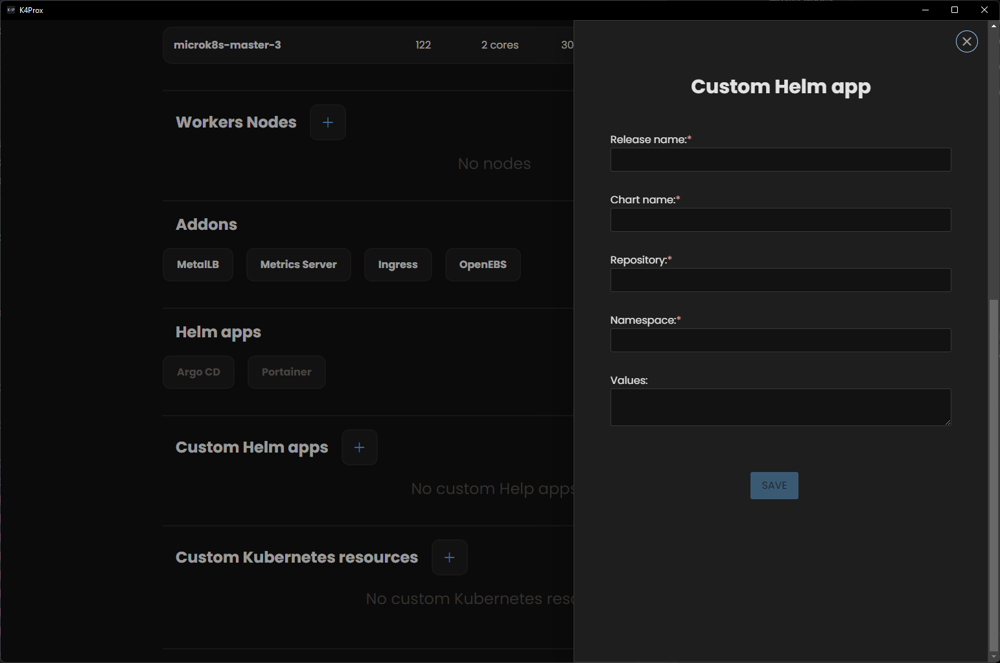
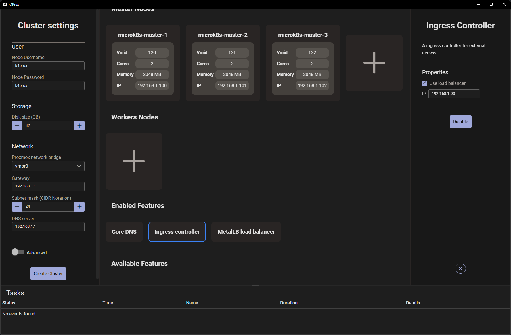
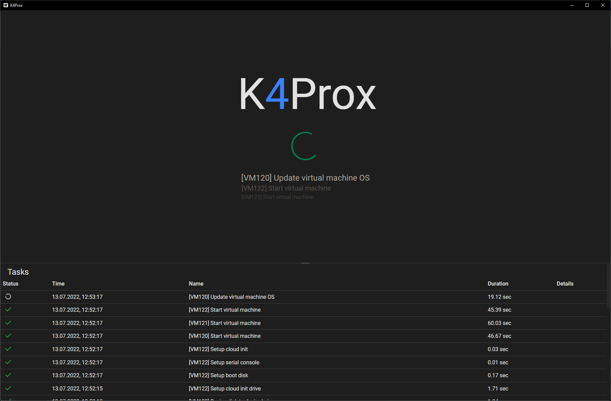
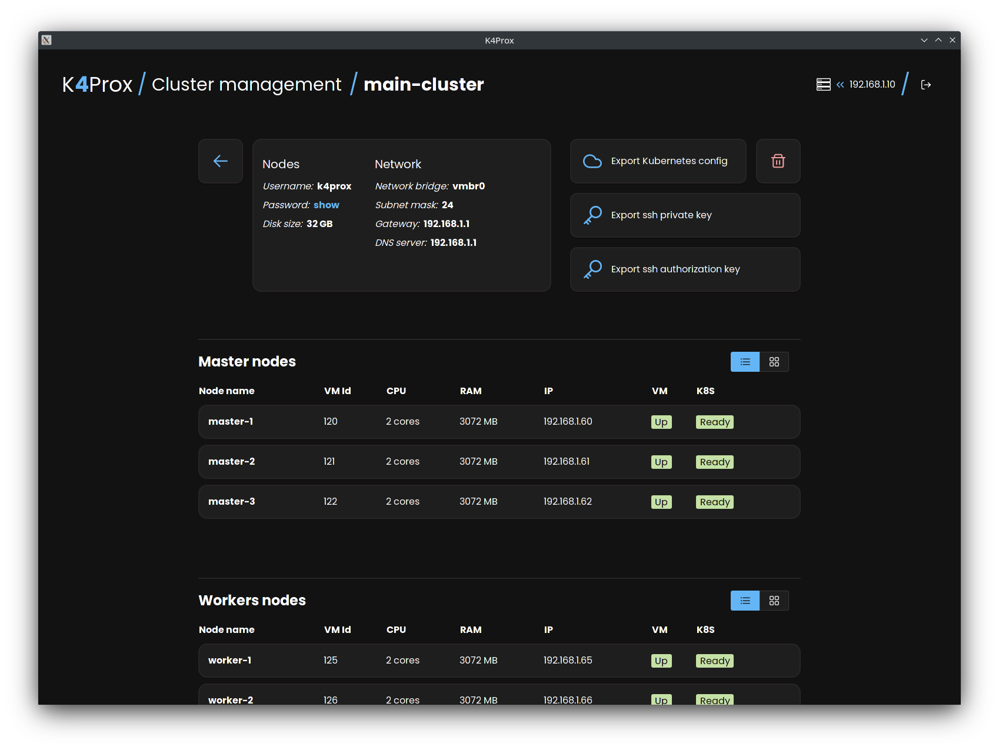

  

  
  

## Table of contents

- [:grey_question: What is this?](#what-is-this)
- [:pushpin: Plans for the future](#plans-for-the-future)
- [:hammer: Building from source and development](#building-from-source-and-development)
- [:blue_book: Licence](./LICENCE)
- [:camera: Screenshots](#screenshots)

## :grey_question: What is this?

**K4Prox** is a desktop application, for managing Kubernetes installations in Proxmox VE.
The application automates creating a high available multi-node Kubernetes cluster
*(tested on Proxmox 7.2-7)*.

**What does the K4Prox under the hood?**

- Generates the best possible default project for your environment
    * checks used vmid's in your proxmox to find the first free 20 id's
      range, starts from number round to 10 ex. 120, 400, 500 for the first node
    * determines automatically your network settings, like Gateway, Subnet mask and DNS server address
    * try to figure out the IP range for VMs and load balancer, uses ping
      application on your host - it's not guaranteed IP availability due to some devices on your network can have
      disabled ICMP protocol
- Create and configure VMs using Proxmox API and SSH
- Uses Ubuntu Cloud image + Cloud-Init as VM's OS
- Installs MicroK8s using snap
- Configure MicroK8s via SSH (installing addons, joining nodes to the cluster)

**Supported platforms:**

- Linux
- macOS
- Windows (Windows 10 and below requires Microsoft Edge WebView2, automatic installation is provided by Wails)

**Used technologies:**

- [Wails V2 beta](https://wails.io/)
- Go 1.18
- Vue 3 (Pinia, PrimeVue, Tailwind)

## :pushpin: Plans for the future

Project was created in spare time to test [Wails V2 beta](https://wails.io/) library in practice, for my another
application,
also I missed tools for creating Kubernetes cluster on Proxmox so decided take advantage of this situation,
and I wrote my own. I hope it will be useful to someone, but keep in mind, project is in early stage of development.

Basically, development of the project depends on interest of community, feel free to report bugs and features.

**Planned features:**

- Project validation before deploying the cluster
    * checking already used VMIDs
    * checking resource availability on Proxmox
    * checking used IPs for VMs (based on ping, so without guarantee, due to fact that network devices can have disabled
      ICMP)
- Post deploy management
    * add a new node to the existing cluster
    * delete a node from the cluster
    * upgrade Kubernetes
    * change VM resources (CPU, Memory)

- Support more MicroK8s addons nad Helm charts
- Command line app for deploying project
- Web application
    * opens possibilities for live monitoring and autoscaling

## :hammer: Building from source and development

### Live Development

To run in live development mode, run `wails dev` in the project directory.

### Building

To build a redistributable, production mode package, use `wails build`.

# :camera: Screenshots

